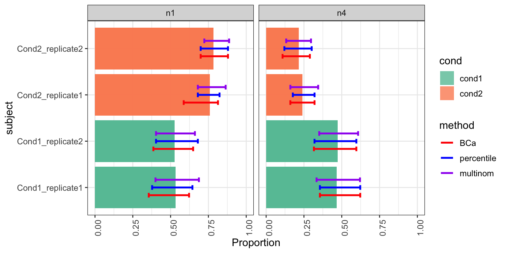
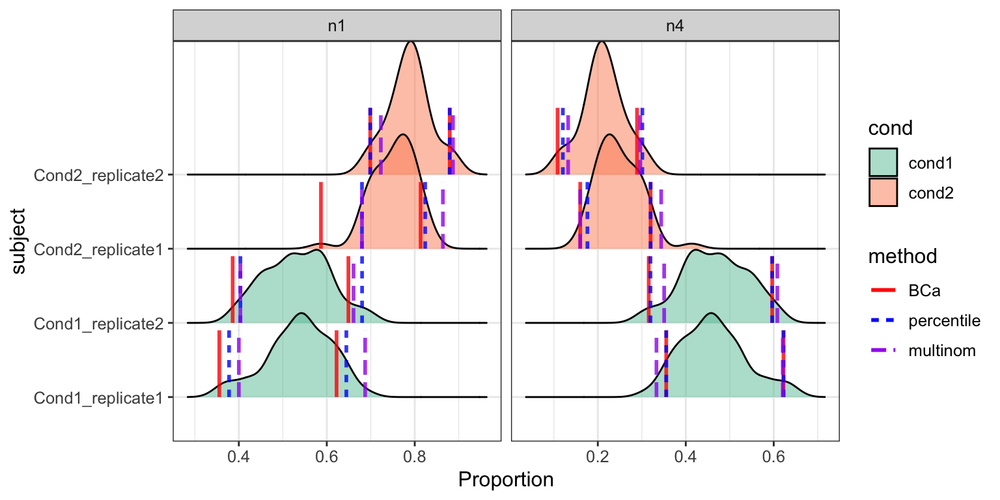

# scdney - Single cell data integrative analysis

<br />

<!--

-->

[](https://github.com/SydneyBioX/scdney/commits/master)

<br />

`scdney` is a R package with collection of single cell RNA-sequencing (scRNA-seq) data analysis functions developed by team of <a href = "http://www.maths.usyd.edu.au/u/SMS/bioinformatics/">**Sydney Precision Bioinformatics Research Group**</a> at The University of Sydney.

This package contains useful functions for analysis of scRNA-seq data including clustering, cell type identification, etc.


# Getting started

## Vignette

You can find the vignette at our website:  https://sydneybiox.github.io/scdney/.


## Installation

```r
devtools::install_github("SydneyBioX/scdney", build_opts = c("--no-resave-data", "--no-manual"))
library(scdney)
```

For `devtools (< 2.0.0)`,

```r
devtools::install_github("SydneyBioX/scdney", build_vignettes = TRUE)
library(scdney)
```


Building the vignette may take some time. If you wish not to create the vignette during installation, try:

```r
devtools::install_github("SydneyBioX/scdney")
library(scdney)
```


**NOTE:** *For mac users, the official cran mirror of R tools for OS X and R tools for OS X on r.research.att.com that lists the gfortran binary are out of date. You will need to update `gfortran` and add the following line `FLIBS=-L/usr/local/Cellar/gcc/X.Y.Z/lib/gcc/X` (where `X.Y.Z` is your gcc version) to `~/.R/Makevars` prior to this package installation.*


# Usage


## Section 1 - Clustering

### scClust

See: Kim, T., Chen, I., Lin, Y., Wang, A., Yang, J., & Yang, P.† (2018) Impact of similarity metrics on single-cell RNA-seq data clustering. ***Briefings in Bioinformatics*** <a href="https://doi.org/10.1093/bib/bby076">[https://doi.org/10.1093/bib/bby076]</a>


Current version of this package is implemented to run a modified version of SIMLR (Wang et al, 2017) or k-means clustering methods with various similarity metrics.

Available metrics include:

SIMLR - `"pearson"` correlation, `"spearman"` corelation and `"euclidean"` distance.

K-means - `"pearson"` correlation, `"spearman"` correlation, `"euclidean"` distance, `"manhattan"` distance and `"maximum"` distance.


#### Load Data

```r
data(GSE82187.sample)
mat <- GSE82187

mat <- log2(mat+1)

# set number of clusters (classes defined in colnames)
nCs <- length(table(colnames(mat)))
```

#### Part A. Clustering with different similarity metrics with `scClust`

To run scClust,

```r
# SIMLR
simlr.result <- scClust(mat, nCs, similarity = "pearson", method = "simlr", seed = 1, cores.ratio = 0)

# K-means
kmeans.result <- scClust(mat, nCs, similarity = "pearson", method = "kmeans", seed = 1, nstart = 10, iter.max = 10)
```

This function allows you to perform clustering with a user specified similarity metrics. The return values of `scClust` are identical to clustering methods for `Kmeans` and `SIMLR` functions.


#### Part B. Benchmarking different similarity metrics with `scClustBench`

This section is to compare a set of similarity metrics on clustering methods to benchmark their perfomance accuracy.

To run scClustBench,

```r
# SIMLR
simlr.result <- scClustBench(mat, nCs, method = "simlr", rep = 2, seed = 1, cores = 1, cores.ratio = 0)

# K-means
kmeans.result <- scClustBench(mat, nCs, method = "kmeans", rep = 2, seed = 1, cores = 1, nstart = 10, iter.max = 10)
```


You can evaluate this result with the function `evalScClustBench` and plot with `plotSimlrEval` or `plotKmeansEval`.


For further demonstrations, see:

```r
browseVignettes("scdney")
```


## Section 2 - Post hoc cell type classification

### scReClassify


Current version of this package is implemented to run with `svm` and `radomForest` classifiers.


#### Load data

```r
data(GSE87795_liver.development.data)
dat <- GSE87795_liver.development.data$data
cellTypes <- GSE87795_liver.development.data$cellTypes

# number of clusters
nCs <- length(table(cellTypes))

# This demo dataset is already pre-processed
dat.processed = dat
```

#### Part A. scReClassify (Demonstration)

##### Dimension reduction

```r
dat.selected = matPCs(dat.processed, 0.7)
```

##### Synthetic noise (Demonstration purpose)

Here in this example, we will synthetically generate varying degree of noise in sample labels.

```r
lab <- cellTypes

set.seed(1)
noisyCls <- function(dat, rho, cls.truth){
  cls.noisy <- cls.truth
  names(cls.noisy) <- colnames(dat)
  for(i in 1:length(table(cls.noisy))) {
    # class label starts from 0
    if (i != length(table(cls.noisy))) {
      cls.noisy[sample(which(cls.truth == names(table(cls.noisy))[i]), floor(sum(cls.truth == names(table(cls.noisy))[i]) * rho))] <- names(table(cls.noisy))[i+1]
    } else {
      cls.noisy[sample(which(cls.truth == names(table(cls.noisy))[i]), floor(sum(cls.truth == names(table(cls.noisy))[i]) * rho))] <- names(table(cls.noisy))[1]
    }
  }

  print(sum(cls.truth != cls.noisy))
  return(cls.noisy)
}

cls.noisy01 <- noisyCls(dat.selected, rho=0.1, lab)
cls.noisy02 <- noisyCls(dat.selected, rho=0.2, lab)
cls.noisy03 <- noisyCls(dat.selected, rho=0.3, lab)
cls.noisy04 <- noisyCls(dat.selected, rho=0.4, lab)
cls.noisy05 <- noisyCls(dat.selected, rho=0.5, lab)
```

##### Use scReClassify with AdaSampling to correct mislabelled cell types.

Here, we will only Support Vector machine (`svm`) as base classifier.

#### Benchmark Evaluation

```r
###################################
# SVM
###################################
acc01 <- acc02 <- acc03 <- acc04 <- acc05 <- c()
ari01 <- ari02 <- ari03 <- ari04 <- ari05 <- c()
base <- "svm"

for(j in 1:10) {
  final <- multiAdaSampling(dat.selected, cls.noisy01, seed=j, classifier=base, percent=1, L=10)$final
  ari01 <- c(ari01, mclust::adjustedRandIndex(lab, final))
  acc01 <- c(acc01, bAccuracy(lab, final))
  final <- multiAdaSampling(dat.selected, cls.noisy02, seed=j, classifier=base, percent=1, L=10)$final
  ari02 <- c(ari02, mclust::adjustedRandIndex(lab, final))
  acc02 <- c(acc02, bAccuracy(lab, final))
  final <- multiAdaSampling(dat.selected, cls.noisy03, seed=j, classifier=base, percent=1, L=10)$final
  ari03 <- c(ari03, mclust::adjustedRandIndex(lab, final))
  acc03 <- c(acc03, bAccuracy(lab, final))
  final <- multiAdaSampling(dat.selected, cls.noisy04, seed=j, classifier=base, percent=1, L=10)$final
  ari04 <- c(ari04, mclust::adjustedRandIndex(lab, final))
  acc04 <- c(acc04, bAccuracy(lab, final))
  final <- multiAdaSampling(dat.selected, cls.noisy05, seed=j, classifier=base, percent=1, L=10)$final
  ari05 <- c(ari05, mclust::adjustedRandIndex(lab, final))
  acc05 <- c(acc05, bAccuracy(lab, final))
}

result = list(
  acc01 = acc01,
  acc02 = acc02,
  acc03 = acc03,
  acc04 = acc04,
  acc05 = acc05,
  ari01 = ari01,
  ari02 = ari02,
  ari03 = ari03,
  ari04 = ari04,
  ari05 = ari05
)

plot.new()
par(mfrow = c(1,2))
boxplot(acc01, acc02, acc03, acc04, acc05, col="lightblue", main="SVM Acc", ylim=c(0.45, 1))
points(x=1:5, y=c(bAccuracy(lab, cls.noisy01), bAccuracy(lab, cls.noisy02),
                  bAccuracy(lab, cls.noisy03), bAccuracy(lab, cls.noisy04),
                  bAccuracy(lab, cls.noisy05)), col="red3", pch=c(2,3,4,5,6), cex=1)
boxplot(ari01, ari02, ari03, ari04, ari05, col="lightblue", main="SVM ARI", ylim=c(0.25, 1))
points(x=1:5, y=c(mclust::adjustedRandIndex(lab, cls.noisy01), mclust::adjustedRandIndex(lab, cls.noisy02),
                  mclust::adjustedRandIndex(lab, cls.noisy03), mclust::adjustedRandIndex(lab, cls.noisy04),
                  mclust::adjustedRandIndex(lab, cls.noisy05)), col="red3", pch=c(2,3,4,5,6), cex=1)
```

#### Part B. - scReClassify (mislabelled cell type correction)

```r
# PCA procedure
dat.pc <- matPCs(dat.processed, 0.7)
dim(dat.pc)

# run scReClassify
cellTypes.reclassify <- multiAdaSampling(dat.pc, cellTypes, seed = 1, classifier = "svm", percent = 1, L = 10)

# Verification by marker genes
End <- c("KDR", "LYVE1")

# check examples
idx <- which(cellTypes.reclassify$final != cellTypes)
library(dplyr)
cbind(original=cellTypes[idx], reclassify=cellTypes.reclassify$final[idx]) %>%
  DT::datatable()

c1 <- dat.processed[, which(cellTypes=="Endothelial Cell")]
c2 <- dat.processed[, which(cellTypes=="Erythrocyte")]
c3 <- dat.processed[, which(cellTypes=="Hepatoblast")]
c4 <- dat.processed[, which(cellTypes=="Macrophage")]
c5 <- dat.processed[, which(cellTypes=="Megakaryocyte")]
c6 <- dat.processed[, which(cellTypes=="Mesenchymal Cell")]
cs <- rainbow(length(table(cellTypes)))

# (example 1 E13.5_C20)
#####
par(mfrow=c(1,2))
marker <- End[1]
boxplot(c1[marker,], c2[marker,], c3[marker,], c4[marker,], c5[marker,], c6[marker,], col=cs, main=marker)
points(1, dat.processed[marker, which(colnames(dat.processed) %in% "E13.5_C20")], pch=16, col="red", cex=2)
marker <- End[2]
boxplot(c1[marker,], c2[marker,], c3[marker,], c4[marker,], c5[marker,], c6[marker,], col=cs, main=marker)
points(1, dat.processed[marker, which(colnames(dat.processed) %in% "E13.5_C20")], pch=16, col="red", cex=2)
#####

```

## Section 3 -  single cell differential composition analysis with scDC

### Load in example data 

```r
data("sim")
exprsMat <- sim$sim_exprsMat
subject <- sim$sim_subject
cellTypes <- sim$sim_cellTypes
cond <- sim$sim_cond

dim(exprsMat)
#> [1] 500 260
table(subject, cellTypes)
#>                   cellTypes
#> subject            n1 n4
#>   Cond1_replicate1 24 21
#>   Cond1_replicate2 30 27
#>   Cond2_replicate1 57 18
#>   Cond2_replicate2 66 17
table(cond, cellTypes)
#>        cellTypes
#> cond     n1  n4
#>   Cond1  54  48
#>   Cond2 123  35
```
### Perform scDC (without clustering)
`nboot` (number of bootstraps) is set to be 10000 by default. This is the recommended value for achieving the resolution required by confidence interval. In here, we set nboot=50 just for illustration purpose.   

The code can be run in parallel environment by passing in the `ncores` argument. By default , ncores = 1.

```r
res_scDC_noClust <- scDC_noClustering(cellTypes, subject, calCI = TRUE, 
                                     calCI_method = c("percentile", "BCa", "multinom"),
                                     nboot = 50)
#> [1] "Calculating sample proportion..."
#> [1] "Calculating bootstrap proportion..."
#> [1] "Calculating percentile ..." "Calculating BCa ..."       
#> [3] "Calculating multinom ..."  
#> [1] "Calculating z0 ..."
#> [1] "Calculating acc ..."
```


### Visualisation
scDC provides two forms of visualisation, barplot and density plot.   
The second argument is the label of each sample. In this data, there are 4 samples of cond1 and 4 samples of cond2. 

```r
barplotCI(res_scDC_noClust, c("cond1","cond1","cond1","cond1",
                              "cond2","cond2","cond2","cond2"))
                              
```





```r
densityCI(res_scDC_noClust, c("cond1","cond1","cond1","cond1",
                              "cond2","cond2","cond2","cond2"))
#> Picking joint bandwidth of 0.0239
#> Picking joint bandwidth of 0.0239
                              
```


### Fitting GLM
Cell count output from each bootstrap can be fitted using GLM, which analyse the significance of variables associated with cell counts. The GLM models are pooled using Rubin's rules to provide an overall estimates of statistics.


```r
res_GLM <- fitGLM(res_scDC_noClust, c("cond1","cond1","cond1","cond1",
                                      "cond2","cond2","cond2","cond2"), 
                  pairwise = FALSE)
#> Warning in checkConv(attr(opt, "derivs"), opt$par, ctrl =
#> control$checkConv, : Model failed to converge with max|grad| = 0.0151388
#> (tol = 0.001, component 1)
#> [1] "fitting GLM... 10"
#> Warning in checkConv(attr(opt, "derivs"), opt$par, ctrl =
#> control$checkConv, : Model failed to converge with max|grad| = 0.00202052
#> (tol = 0.001, component 1)
#> [1] "fitting GLM... 20"
#> Warning in checkConv(attr(opt, "derivs"), opt$par, ctrl =
#> control$checkConv, : Model failed to converge with max|grad| = 0.0127663
#> (tol = 0.001, component 1)
#> [1] "fitting GLM... 30"
#> Warning in checkConv(attr(opt, "derivs"), opt$par, ctrl =
#> control$checkConv, : Model failed to converge with max|grad| = 0.00690679
#> (tol = 0.001, component 1)
#> [1] "fitting GLM... 40"
#> [1] "fitting GLM... 50"
                              
```


### Summary of GLM results
#### Fixed effect
```r
summary(res_GLM$pool_res_fixed)
#>                           estimate std.error  statistic        df
#> (Intercept)              3.1766364 0.2021867 15.7114008 0.9065430
#> cellTypesn4             -0.1421987 0.2929871 -0.4853411 0.5553828
#> condcond2                0.9811378 0.2385603  4.1127457 0.9450767
#> subjectCond1_replicate2  0.2363888 0.1994143  1.1854153 1.1998800
#> subjectCond2_replicate1 -0.1013525 0.1593158 -0.6361736 1.1998800
#> cellTypesn4:condcond2   -1.0794396 0.3994029 -2.7026332 0.5714735
#>                            p.value
#> (Intercept)             0.02454555
#> cellTypesn4             0.70113140
#> condcond2               0.11938361
#> subjectCond1_replicate2 0.41965889
#> subjectCond2_replicate1 0.62431043
#> cellTypesn4:condcond2   0.19079656
```


```r
summary(res_GLM$pool_res_random)
#>                         estimate std.error  statistic        df    p.value
#> (Intercept)            3.3018092 0.1687007 19.5719937 1.2957214 0.01194922
#> cellTypesn4           -0.1422120 0.2929826 -0.4853939 0.9236613 0.69342565
#> condcond2              0.8065714 0.1969060  4.0962264 1.3747009 0.09891140
#> cellTypesn4:condcond2 -1.0794020 0.3993927 -2.7026081 0.9504796 0.16732621
```

### scDC (with clustering)  
scDC has two options of performing cell type proportion estimates, without clustering and with clustering. 
When performed without clustering,the estimation does not take into account for the variability from clustering algorithm, and only takes variability from the population into account. 
When performed with clustering, the estimation takes both into consideration.

```r
res_scDC_clust = scDC_clustering(expresMat, cellTypes, 
                                   subject, calCI = TRUE, 
                                   calCI_method = c("percentile", "BCa", "multinom"))
```

### Visualisation

```r
barplotCI(res_scDC_clust, c("cond1","cond1","cond1","cond1",
                            "cond2","cond2","cond2","cond2")))
densityCI(res_scDC_clust, c("cond1","cond1","cond1","cond1",
                            "cond2","cond2","cond2","cond2")))
```

### Fitting GLM

```r
res_GLM <- fitGLM(res_scDC_noClust,
                  c("cond1","cond1","cond1","cond1",
                    "cond2","cond2","cond2","cond2"), pairwise = FALSE)
```


### Summary of GLM results

#### Fixed effect

```r
summary(res_GLM$pool_res_fixed)
```


#### Random effect 
```r
summary(res_GLM$pool_res_random)
```


